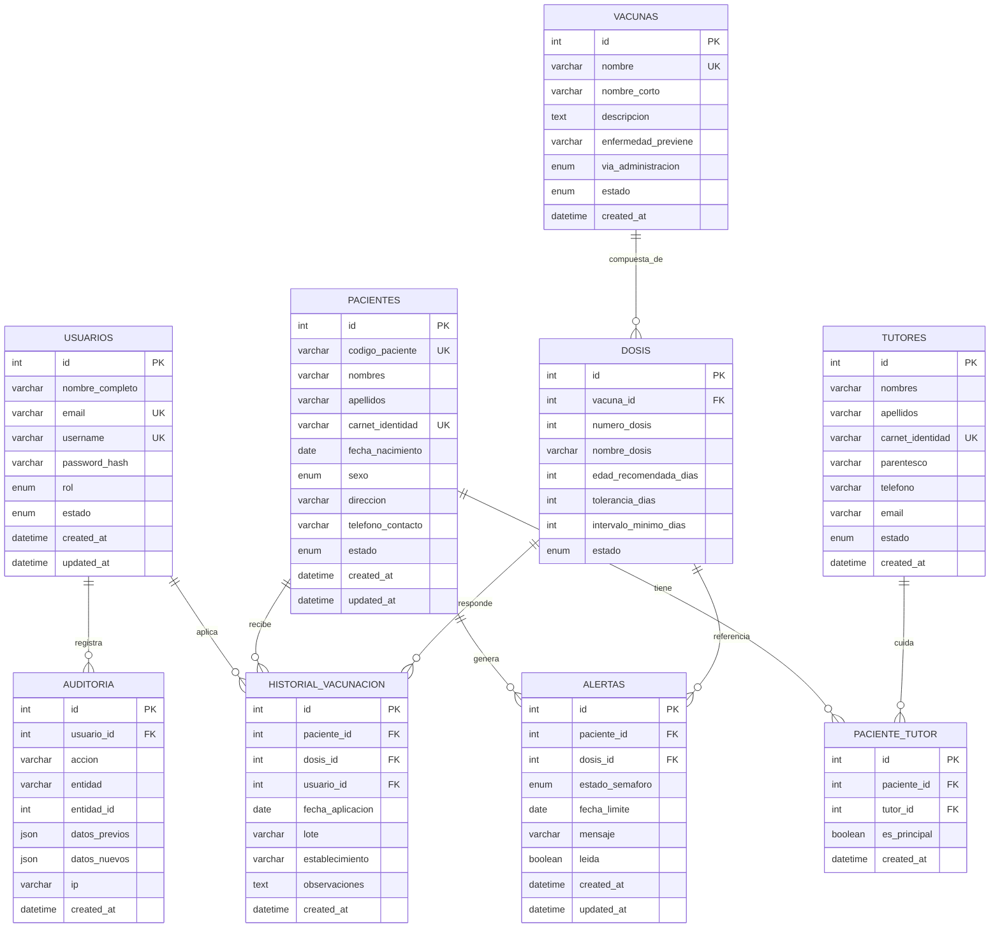
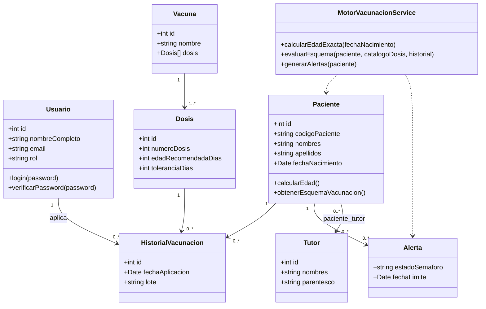

# Fase 2 — Diseño del Sistema

## 1. Arquitectura general

Arquitectura **cliente-servidor** de 3 capas, con **API REST** y patrón **MVC + capa de servicios** en el backend:

```
┌─────────────────────────┐        HTTPS / JSON        ┌──────────────────────────────┐        TCP/IP        ┌───────────────┐
│   FRONTEND (React SPA)   │  ───────────────────────▶  │   BACKEND (Node.js/Express)   │  ──────────────────▶ │  MySQL (BD)   │
│  Vite · Router · Axios   │  ◀───────────────────────  │  Routes → Controllers →       │  ◀────────────────── │  9 tablas     │
│  Context API · Tailwind  │        JWT Bearer           │  Services → Models (mysql2)   │                       │  InnoDB       │
└─────────────────────────┘                             └──────────────────────────────┘                       └───────────────┘
        SPA responsive                                   Middlewares: auth (JWT), roles,             Respaldo automático (mysqldump)
        (móvil / tablet / desktop)                        auditoría, validación, errores               programado (node-cron)
```

**Capas del backend (MVC + servicios):**

- **Routes** — definen los endpoints y aplican middlewares (auth, rol, validación).
- **Controllers** — reciben `req/res`, invocan servicios, formatean la respuesta HTTP (sin lógica de negocio).
- **Services** — lógica de negocio pura (reglas de negocio, motor inteligente PAI, generación de PDF/QR, reportes).
- **Models** — acceso a datos con `mysql2/promise` (consultas parametrizadas, sin ORM, para control total sobre SQL e índices).
- **Middlewares** — `auth.middleware` (verifica JWT), `role.middleware` (autorización por rol), `audit.middleware` (bitácora), `error.middleware` (manejo centralizado de errores), `validate.middleware` (express-validator).
- **Config** — conexión a BD (pool `mysql2`), variables de entorno, configuración de CORS/Helmet.
- **Utils** — cálculo de edad, motor de esquema PAI, JWT sign/verify, generación de PDF (pdfkit) y QR (qrcode), generación de Excel (exceljs), respaldo (mysqldump vía `child_process`).

**Frontend (SPA):**

- **pages** — una vista por ruta (Login, Dashboards, Pacientes, etc.).
- **components** — piezas reutilizables (Table, Modal, Card, Sidebar, Navbar, Pagination, SearchBar, Badge de alerta).
- **layouts** — `AuthLayout` (login) y `MainLayout` (sidebar + navbar + contenido, para usuarios autenticados).
- **context** — `AuthContext` (usuario, token, login/logout, persistencia).
- **services** — wrappers de Axios por recurso (`auth.service.js`, `pacientes.service.js`, etc.) con interceptores JWT.
- **hooks** — `useAuth`, `useFetch`, `useDebounce` (búsqueda en tiempo real), `usePagination`.
- **routes** — `AppRoutes.jsx` + `ProtectedRoute.jsx` (guardas por rol).

## 2. Modelo Entidad-Relación



## 3. Diagrama relacional (resumen de claves)

| Tabla | PK | FK | Índices / Restricciones |
|---|---|---|---|
| usuarios | id | — | UNIQUE(email), UNIQUE(username), CHECK(rol) |
| pacientes | id | — | UNIQUE(codigo_paciente), UNIQUE(carnet_identidad), INDEX(nombres, apellidos), INDEX(fecha_nacimiento) |
| tutores | id | — | UNIQUE(carnet_identidad), INDEX(apellidos) |
| paciente_tutor | id | paciente_id → pacientes.id, tutor_id → tutores.id | UNIQUE(paciente_id, tutor_id) |
| vacunas | id | — | UNIQUE(nombre) |
| dosis | id | vacuna_id → vacunas.id | UNIQUE(vacuna_id, numero_dosis), INDEX(edad_recomendada_dias) |
| historial_vacunacion | id | paciente_id → pacientes.id, dosis_id → dosis.id, usuario_id → usuarios.id | UNIQUE(paciente_id, dosis_id), INDEX(fecha_aplicacion) |
| alertas | id | paciente_id → pacientes.id, dosis_id → dosis.id | UNIQUE(paciente_id, dosis_id), INDEX(estado_semaforo) |
| auditoria | id | usuario_id → usuarios.id | INDEX(entidad, entidad_id), INDEX(created_at) |

Todas las FK usan `ON DELETE RESTRICT ON UPDATE CASCADE` salvo `paciente_tutor` (`ON DELETE CASCADE` hacia la tabla puente) y `auditoria.usuario_id` (`ON DELETE SET NULL`, para conservar la bitácora aunque se desactive un usuario).

## 4. Diseño UML — Clases de dominio (backend)



## 5. Diseño de módulos

1. **Módulo de Autenticación y Seguridad** — login, JWT, bcrypt, middlewares de autorización.
2. **Módulo de Usuarios** — CRUD de personal, roles.
3. **Módulo de Pacientes** — CRUD, búsqueda, ficha clínica.
4. **Módulo de Tutores** — CRUD, vinculación N:M con pacientes.
5. **Módulo de Vacunas y Dosis** — catálogo maestro (PAI Bolivia).
6. **Módulo de Historial de Vacunación** — registro y consulta de aplicaciones.
7. **Módulo Inteligente de Vacunación** — cálculo de edad, comparación con esquema PAI, clasificación de estados.
8. **Módulo de Alertas** — generación y visualización del semáforo verde/amarillo/rojo.
9. **Módulo de Carnet Digital** — generación de PDF + QR.
10. **Módulo de Reportes** — generación y exportación PDF/Excel.
11. **Módulo de Auditoría** — bitácora de acciones.
12. **Módulo de Respaldo** — backup automático de BD (`mysqldump` programado con `node-cron`).

## 6. Diseño de la API REST

Prefijo base: `/api/v1`. Todas las rutas (excepto `/auth/login`) requieren header `Authorization: Bearer <token>`.

| Recurso | Método y ruta | Rol requerido |
|---|---|---|
| Auth | `POST /auth/login` | público |
| Auth | `POST /auth/logout` | autenticado |
| Auth | `GET /auth/me` | autenticado |
| Usuarios | `GET/POST /usuarios`, `GET/PUT/DELETE /usuarios/:id` | administrador |
| Pacientes | `GET/POST /pacientes`, `GET/PUT/DELETE /pacientes/:id`, `GET /pacientes/buscar?q=` | autenticado |
| Tutores | `GET/POST /tutores`, `GET/PUT/DELETE /tutores/:id`, `POST /tutores/:id/pacientes/:pacienteId` | autenticado |
| Vacunas | `GET/POST /vacunas`, `GET/PUT/DELETE /vacunas/:id` | admin (escritura) / autenticado (lectura) |
| Dosis | `GET/POST /vacunas/:id/dosis`, `PUT/DELETE /dosis/:id` | admin (escritura) / autenticado (lectura) |
| Historial | `GET /pacientes/:id/historial`, `POST /historial`, `PUT /historial/:id` | autenticado |
| Esquema inteligente | `GET /pacientes/:id/esquema` (pendientes/próximas/atrasadas) | autenticado |
| Alertas | `GET /alertas`, `GET /alertas/paciente/:id`, `PATCH /alertas/:id/leida` | autenticado |
| Carnet | `GET /pacientes/:id/carnet` (PDF) | autenticado |
| Reportes | `GET /reportes/:tipo?formato=pdf|excel` | autenticado |
| Auditoría | `GET /auditoria` | administrador |
| Respaldo | `POST /backup`, `GET /backup` (histórico) | administrador |

Cada respuesta sigue el formato estándar:

```json
{ "success": true, "data": { }, "message": "" }
{ "success": false, "message": "Descripción del error", "errors": [] }
```
